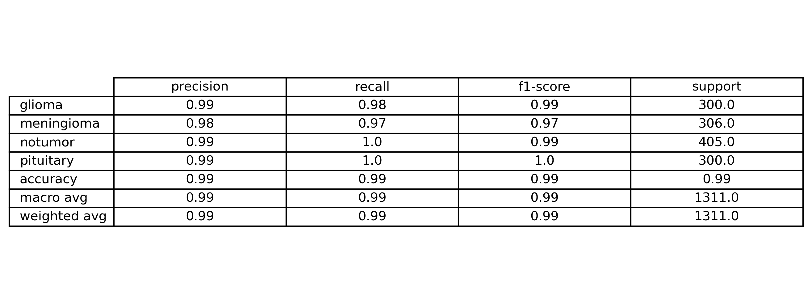
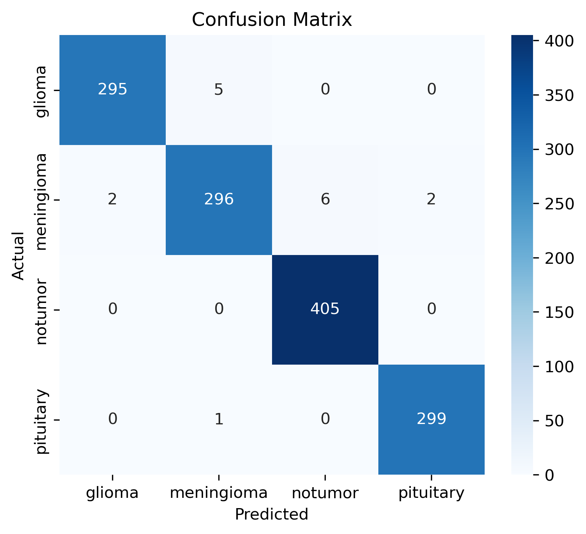
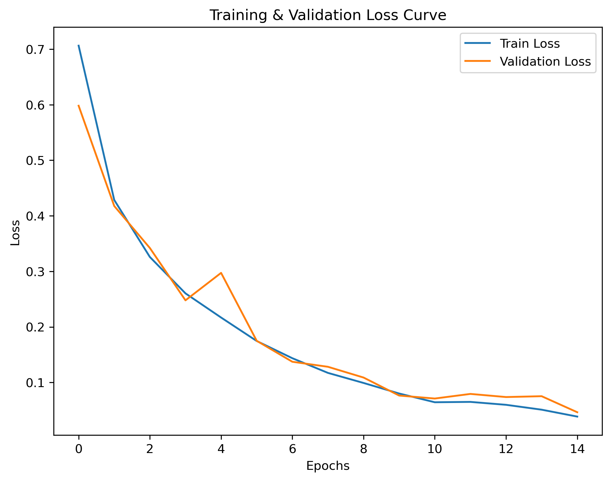

# 🧠 Brain Tumor Classification (MRI) using CNN

This project implements a **Convolutional Neural Network (CNN)** to classify brain MRI images into four categories:  
- **Glioma**  
- **Meningioma**  
- **No Tumor**  
- **Pituitary Tumor**  

The dataset comes from [Brain Tumor Classification (MRI) - Kaggle](https://www.kaggle.com/datasets/sartajbhuvaji/brain-tumor-classification-mri).

---

## 🚀 Project Pipeline

### **Step 1: Dataset**
The dataset is organized as:
```bash
Brain_Tumor/
│── Training/
│   ├── glioma/
│   ├── meningioma/
│   ├── notumor/
│   └── pituitary/
│
└── Testing/
    ├── glioma/
    ├── meningioma/
    ├── notumor/
    └── pituitary/
```

### **Step 2: Model**
A CNN was trained **from scratch** with:
- 3 Convolutional layers (ReLU + MaxPooling)  
- Fully connected layers with Dropout  
- Softmax output (4 classes)  

Training achieved **~98.8% accuracy** on the test set.

### **Step 3: Evaluation**
- **Classification Report** (precision, recall, F1)  
- **Confusion Matrix**  
- **Per-Class Accuracy** bar chart  

### **Step 4: Inference**
Use a single image for prediction with `predict_and_show_topk()`:
- Upload an MRI image  
- Get Top-k predictions with probabilities  
- Visualize the MRI with predicted class  

### **Step 5: Web Interface**
A **Streamlit app** was built for a user-friendly interface:
- Upload MRI images  
- View prediction + confidence bar chart  
- Display reference images of predicted class  

Run locally:
```bash
streamlit run app.py
```

### **Step 6: Deployment**
Packaged for Hugging Face Spaces / Docker / Render
Portfolio-ready demo can be shared via public link

### 📊 Results
Train Accuracy: ~98.6%
Validation Accuracy: ~98.8%

### Classification Report (precision, recall, F1)


### Confusion Matrix


### Training & Validation Loss Curve


### 📂 Repository Structure
```bash
├── app.py                     # Streamlit web app
├── brain_tumor_cnn.pth        # Trained CNN model (weights)
├── train_cnn.py               # Training script (CNN from scratch)
├── classification_report.txt  # Saved classification metrics
├── confusion_matrix.png       # Confusion matrix plot
├── per_class_accuracy.png     # Accuracy per tumor class
├── loss_curve.png             # Training & validation loss curve
├── requirements.txt           # Dependencies
└── README.md                  # Project documentation
```

### 📌 Future Improvements
Add an “Unknown” class or thresholding to reject invalid/non-MRI inputs.
Explore transfer learning with ResNet / EfficientNet for even better performance.
